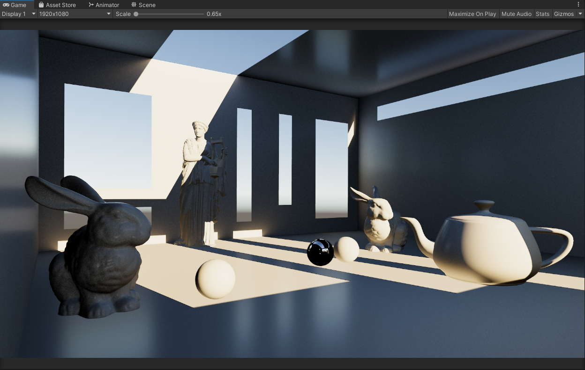
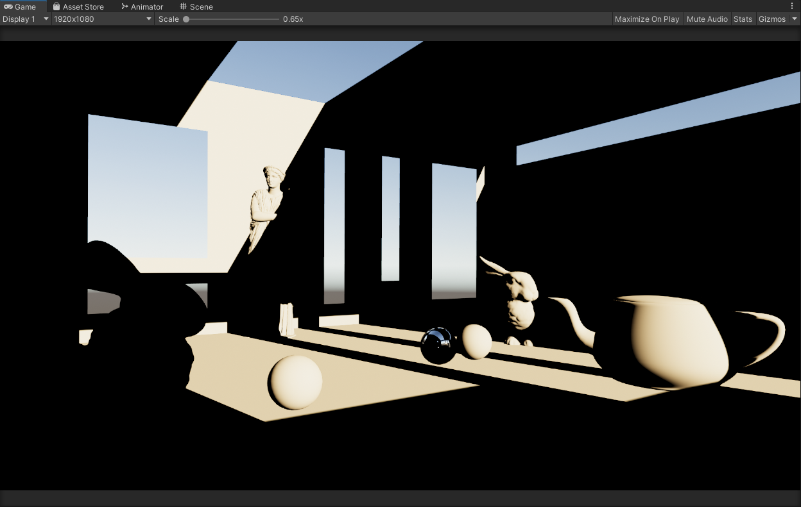
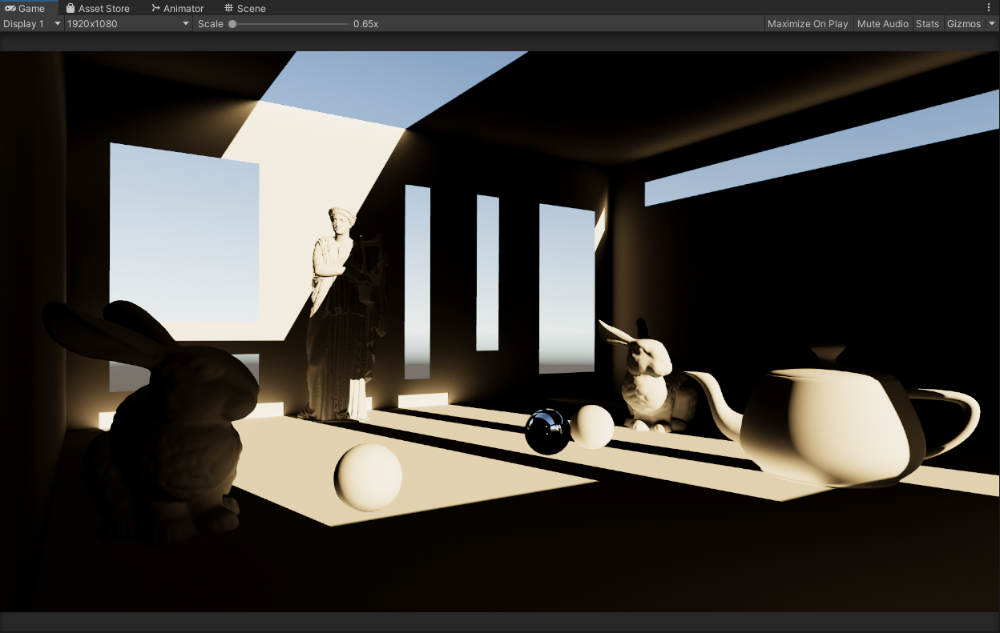
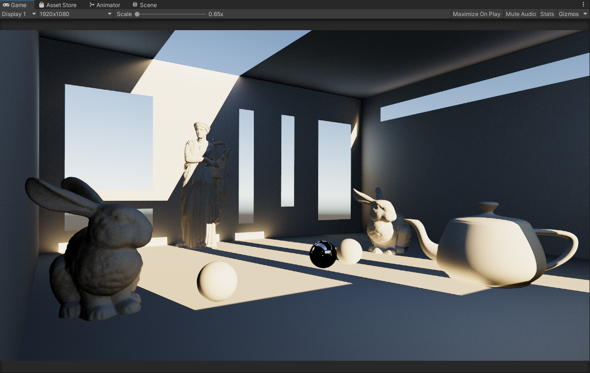

# Unity-Box-Projected-Lighting
A work-in-progress attempt for real-time box projected lighting with GI and reflections.

NOTE: Images are taken at high sample counts with animated noise, and TAA on.

### Version 1

This version computes just simple directional lighting from a cubemap shadow mask.
It's a direct implementation of the effect from the [ARM article](https://developer.arm.com/documentation/102179/0100/Dynamic-soft-shadows-based-on-local-cubemaps).

### Version 2

This version is a little more advanced than the first.

It's an extension of the first version...
- We calculate direct lighting with a cubemap that represents the shadow mask. *(just like the [ARM article](https://developer.arm.com/documentation/102179/0100/Dynamic-soft-shadows-based-on-local-cubemaps))*
- Now in this version we calculate the first bounce from the direct lighting for GI.

For sampling, a cosine-weighted hemisphere oriented with the surface normal is used for better ray convergence.

### Version 3

This version is again, a little more advanced than the last.

It's an extension of the second version...
- We calculate direct lighting with a cubemap that represents the shadow mask. *(just like the [ARM article](https://developer.arm.com/documentation/102179/0100/Dynamic-soft-shadows-based-on-local-cubemaps))*
- We also calculate the first bounce from the direct lighting for GI just like in the second version.
- Now in this version we calculate a first bounce enviornment lighting term.

For sampling once again, a cosine-weighted hemisphere oriented with the surface normal is used for better ray convergence.

### Version 4

This version is again, a little more advanced than the last.

It's an extension of the third version...
- We calculate direct lighting with a cubemap that represents the shadow mask. *(just like the [ARM article](https://developer.arm.com/documentation/102179/0100/Dynamic-soft-shadows-based-on-local-cubemaps))*
- We calculate the first bounce from the direct lighting for GI just like in the second version.
- We also we calculate a first bounce enviornment lighting term just like in the third version.
- Now we calculate enviornment reflections according to PBR material parameters, with a fresnel term.

For sampling once again, a cosine-weighted hemisphere oriented with the surface normal is used for better ray convergence. For the reflections we use an importance sampled GGX function, once again for better ray convergence.

### TODO

- Use Blue Noise for better convergence.
- Use existing Mip Maps to reduce sample counts.
- Precomputation for material BDRF for the reflection term.
- Other techniques if possible to create better ray convergence at lower sample counts.

## References
- **[Dynamic Soft Shadows based on Local Cubemaps (Main Inspiration)](https://developer.arm.com/documentation/102179/0100/Dynamic-soft-shadows-based-on-local-cubemaps)**
- **[lwjgl3 Random Functions](https://github.com/LWJGL/lwjgl3-demos/blob/main/res/org/lwjgl/demo/opengl/raytracing/randomCommon.glsl)**
- **[Unity SRP Core Random.hlsl Functions](https://github.com/Unity-Technologies/Graphics/blob/master/Packages/com.unity.render-pipelines.core/ShaderLibrary/Random.hlsl)**
- **[Unity SRP Core Sampling.hlsl Functions](https://github.com/Unity-Technologies/Graphics/blob/master/Packages/com.unity.render-pipelines.core/ShaderLibrary/Sampling/Sampling.hlsl)**
- **[Filamented PBR Functions](https://google.github.io/filament/Filament.html#materialsystem)**
- **[Hammersley Functions](https://github.com/Unity-Technologies/Graphics/blob/master/Packages/com.unity.render-pipelines.core/ShaderLibrary/Sampling/Hammersley.hlsl)**
- **[Improved Box Projected Reflections](https://github.com/frostbone25/Unity-Improved-Box-Projected-Reflections/tree/main)**
